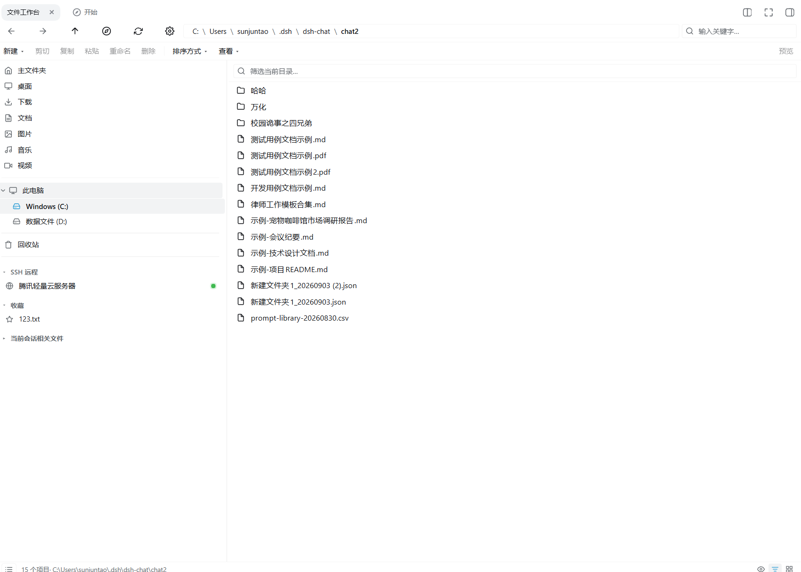
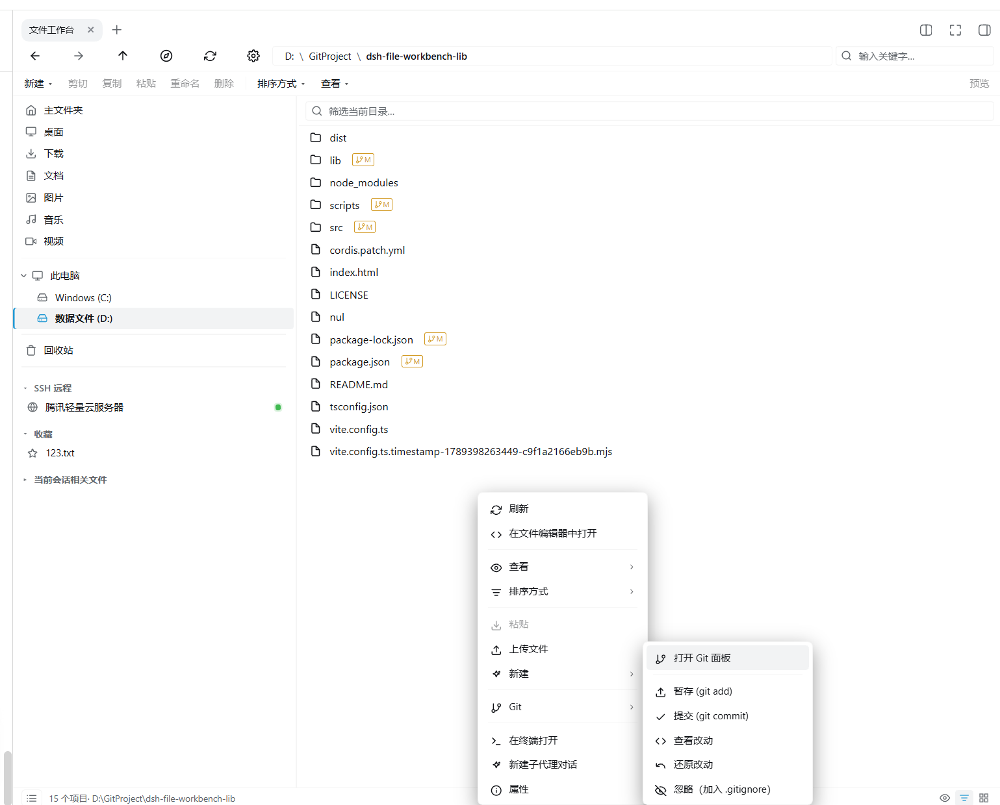
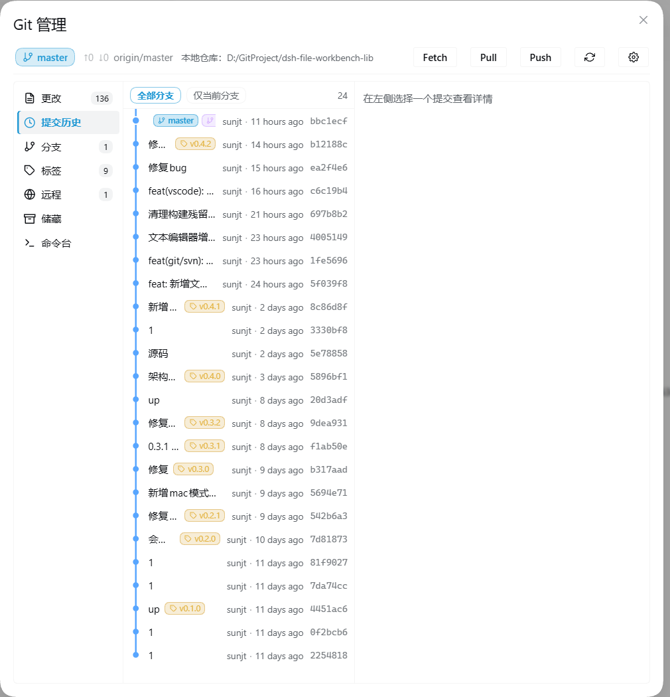
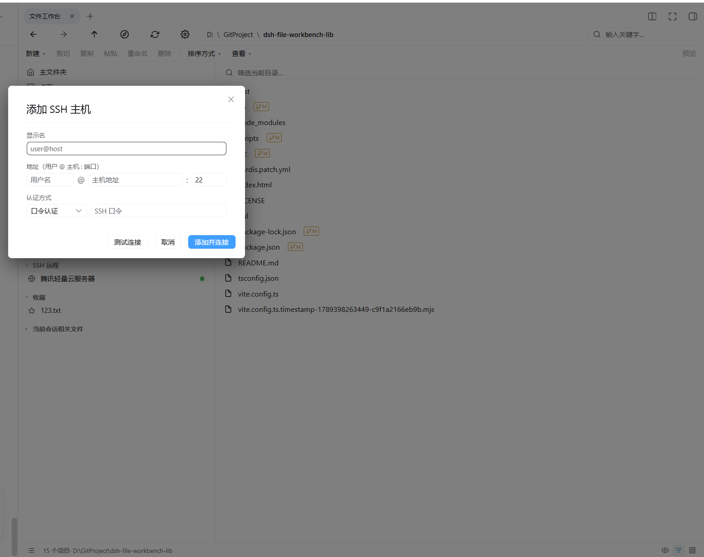
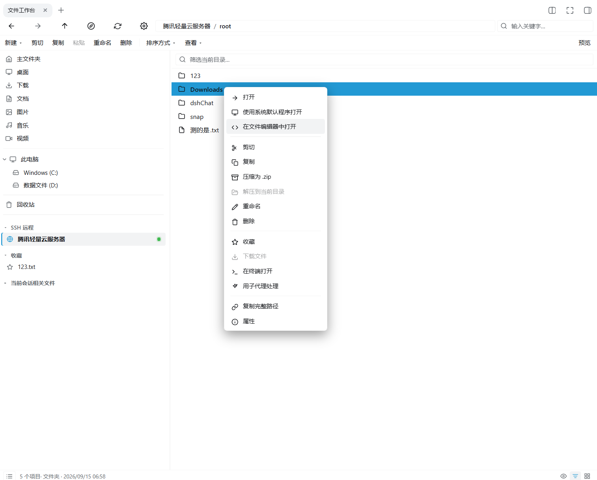
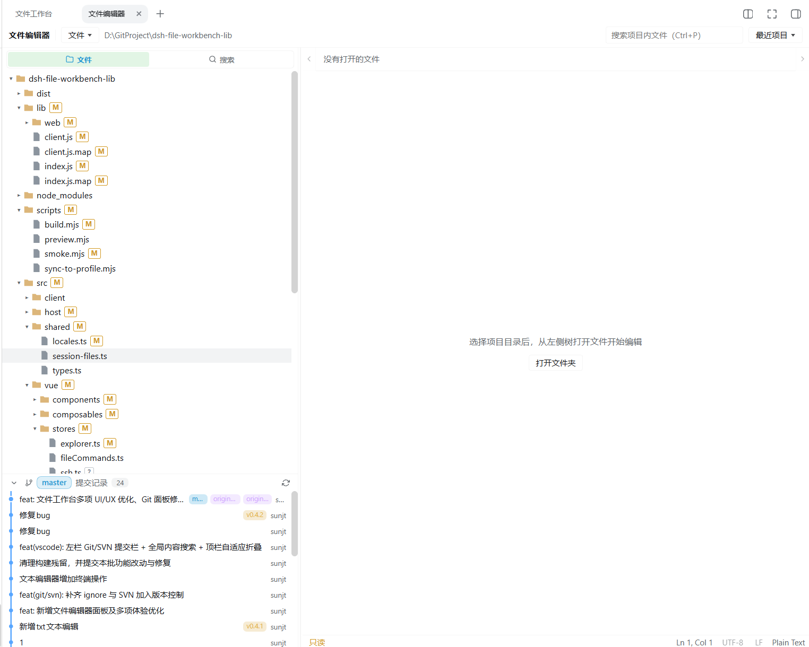
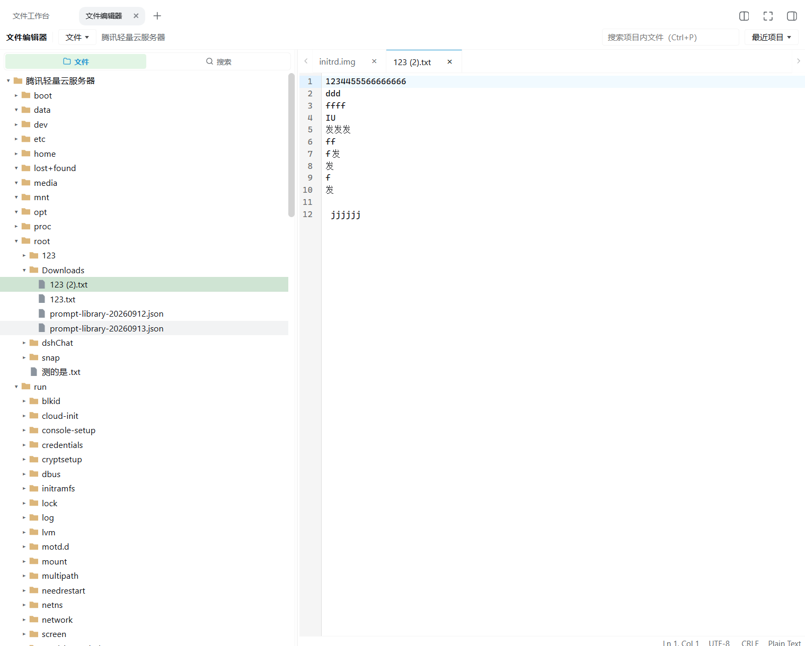
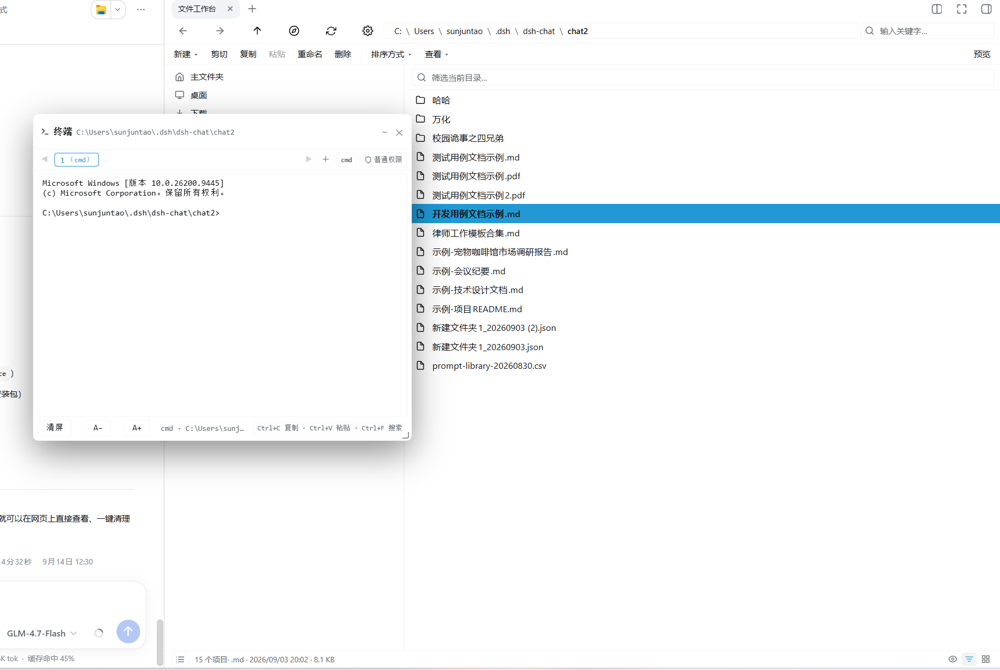

# 给 DSH 装一个「文件工作台」：资源管理器、编辑器、终端、Git 面板，一次到位

> **一句话**：把 Win11 资源管理器的顺手、VS Code 的多标签编辑、一个真终端、一套图形化 Git 面板，全部塞进 DSH 右侧栏——不用离开会话，就能把文件管明白。

而且它不挑地方：**本地磁盘和 SSH 远程服务器一视同仁**。连云主机上的文件，也能像本地一样浏览、编辑、上传下载，一键就能把终端登录到远端目录。

> 📦 **源码仓库**：<https://github.com/master1Sun/dsh-file-workbench-lib>
> 觉得好用的话，顺手点个 ⭐ **Star** 支持一下，也方便你以后找回它。

---

## 为什么值得装

- **少切窗口**：以前改个文件要「开资源管理器 → 翻路径 → 开编辑器 → 保存 → 切回会话」，现在全在右侧栏里闭环，鼠标都少跑几趟。
- **本地远程一个样**：SSH 主机加一次，远端目录就跟本地盘符一样点进点出，不用背 `ssh` 参数，也不用 `scp` 传文件。
- **终端是真终端**：ConPTY 常驻 shell，`npm run dev`、`python`、全屏 TUI 程序都正常跑，中文输出不乱码，关掉面板也不掉线。
- **Git 不用背命令**：暂存、提交、分支、标签、贮藏、diff、blame、cherry-pick……点着就能干；哪天忘了命令，内置命令行区随时兜底。
- **跟会话手拉手**：文件能一键以官方 `@路径` 引用丢进输入框；会话里点到的文件，也能自动跳到这里打开。

---

## 八张图，看懂它能干什么

### 1｜文件工作台：把资源管理器搬进侧边栏



熟悉的味道：左边导航树（主文件夹 / 此电脑盘符 / 回收站 / SSH 远程 / 收藏），右边文件列表，中间一根能拖的分隔条，默认 **3:7**。

地址栏是**面包屑**，点一段跳一段，也能直接改路径回车跳转；工具栏上有新建、剪切、复制、粘贴、重命名、删除，以及**8 档视图**（超大图 → 内容 → 平铺，详情视图列宽还能拖）。双击文件夹往下钻，双击文件交给 DSH 原生查看器，Markdown、代码、图片、PDF、HTML 各显其能。

再往下还有：**递归搜索**（可区分大小写 / 正则，还能跨文件批量替换）、鼠标拉框多选、外部拖拽上传、压缩解压、与列表共用同一套 UI 的**回收站**……以及会自动读取真实卷标的盘符（显示成 `卷标 (C:)` 而不是干巴巴的「本地磁盘」）。

### 2｜右键就是 Git：常用操作不必开口



在目录里点右键，Git 相关操作直接摆在你面前——**打开 Git 面板 / 暂存（git add）/ 提交（git commit）/ 查看改动 / 还原改动 / 忽略（写进 `.gitignore`）**。文件列表里还带着 `?` `A` `M` `D` 状态徽标，谁改了、谁没跟踪，一眼看穿。

菜单很懂分寸：不是 Git 仓库就不显示 Git 项，远端目录也会自动换成远端可用的那一套。

### 3｜Git 管理面板：把命令行装进图形界面



左侧 7 个分区：**变更 / 提交历史 / 分支 / 标签 / 远程 / 贮藏 / 命令行**。

- **变更**：暂存区、未暂存、未跟踪三组，行内暂存、还原、忽略，一键全部暂存 + 提交。
- **提交历史**：提交图（可切「全部 / 仅当前分支」），点开看 hash、作者、时间、parents、refs、文件清单和补丁；`reset`（soft / mixed / hard）、`revert`、`cherry-pick` 都在。
- **分支 / 标签 / 远程 / 贮藏**：新建、切换、合并、推送、删除、发布 Release……常用动作齐活。
- **命令行**：想不起来怎么点？直接敲 git 命令，输出照收。

顶栏还常驻显示当前分支和 `↑ahead ↓behind` 上下游，配 Fetch / Pull / Push 三个大按钮——**SVN** 用户也有对应面板（变更 / 日志 / 输出）。

### 4｜加一台 SSH 主机：一次配置，长期可用



「添加 SSH 主机」对话框，填四样东西：**显示名、地址（用户名 @ 主机 : 端口）、认证方式（口令 / 私钥）、凭据**。

右侧还有「**测试连接**」，通不通先试再说，别等保存完才发现连不上。加好之后，导航树的「SSH 远程」里就多了一台主机，旁边带**连接指示灯**（绿=已连接 / 红=未连接 / 琥珀=检测中 / 灰=尚未检测，30 秒自动刷新）。

### 5｜远端目录 + 一键登录终端

点开 SSH 主机，远端根目录（`boot`、`etc`、`home`、`root`……）就列在右边，接下来的操作和本地几乎没差别：浏览、查看、编辑、增删、重命名、搜索、上传下载、看图片。

**最好用的在这里**：在远端目录右键「在终端打开」，本机终端会**自动帮你敲好 ssh 登录命令**并直接落到那个目录：

```bash
ssh -p 22 -o StrictHostKeyChecking=accept-new -t root@ip "cd '/run' && exec bash -l"
```

不用记主机、不用记端口、不用手打 `cd`。远端不支持的操作（如压缩解压、跨文件替换）会给出明确提示，不会假装能干活。

### 6｜右键「在文件编辑器中打开」：从浏览到编辑一步就到



看到想改的文件，右键即可：

- **打开** — 按默认方式打开；
- **使用系统默认程序打开** — 交给系统关联的软件（本地）；
- **在文件编辑器中打开** — 直接改道到内置编辑器，**本地文件和 SSH 远端文件都行**。

旁边还有压缩为 zip、解压到当前目录、重命名、下载文件、收藏、复制完整路径、用子代理处理等一整排操作。用不了的项会自动置灰。

### 7｜仿 VS Code 的编辑器：该有的都有



- **项目树**：展开状态和滚动位置都会记住；单击选中、双击打开；右键新建文件 / 文件夹、重命名、删除、刷新、添加到会话。
- **多标签**：CodeMirror 6，语言按扩展名**动态加载**——TS / JS / JSON / HTML / CSS / Markdown / YAML / XML / Python / SQL / Java / C++ / Rust / Go / PHP，另有 C# / shell / Ruby 等 legacy 模式，认不出就回退纯文本。标签栏右键可关闭 / 保存并关闭 / 关闭其他 / 关闭右侧 / 关闭全部。
- **`Ctrl+P` 搜项目内文件**、顶栏可切换**最近项目**、底部一条 **Git 提交记录**随时回看改动。
- **状态栏**：行列号、编码（UTF-8）、行尾（LF / CRLF）、语法模式、是否只读，一应俱全。

没打开文件时也有引导态，点「打开文件夹」就能选目录（左栏「我的电脑 + 快捷方式」，右栏对应文件夹，双击下钻、单击选中，也能新建文件夹或手输路径）。

### 8｜改远端文件，跟改本地一样自然



编辑器打开远端文件（示例：`/root/Downloads/123 (2).txt`）后，写、改、`Ctrl+S` 保存，通过 SFTP 直接写回远端。

编码和行尾会被**原样保留**（编辑器内部统一按 `\n` 处理，保存时按原文件的编码与行尾还回去），中文、BOM 都不会被搞坏。状态栏把它是什么编码、什么行尾，明明白白写给你看。

### 9｜终端：浮窗、多标签、还告诉你有没有管理员权限



终端是个**可拖拽的浮窗**——拖到哪都行，右下角能缩放，双击复位；最小化后收进右下角的 **dock 栏**，跨面板常驻，点一下还原。

- **多标签**（最多 9 个），每个标签一个独立会话，**关掉面板也在后台活着**，回来接着看输出；`cmd` / `powershell` 随意切。
- 工具条上有清屏、字号 `A- / A+`、当前 shell 与工作目录，以及 `Ctrl+C` 复制、`Ctrl+V` 粘贴、`Ctrl+F` 搜索（区分大小写）。
- 标签栏还挂着**权限徽标**：显示当前是「管理员」还是「普通权限」，点一下会告诉你怎么拿到管理员终端。

---

## 怎么装

> 仓库地址（欢迎 Star ⭐）：<https://github.com/master1Sun/dsh-file-workbench-lib>

### 方式一：插件市场（最省事）

1. 打开 DSH，进入 **插件市场**；
2. 搜索 **文件工作台** 或 **dsh-file-workbench**；
3. 点安装，然后按提示重启。

### 方式二：一行命令

```bash
dsh plugin --profile web add github:master1Sun/dsh-file-workbench-lib#v0.4.2
```

装完后**重启 `dsh web`**，再在浏览器里 `Ctrl/Cmd + Shift + R` 硬刷新一次即可。

> 如果右侧栏没出现入口，确认 `~/.dsh/profiles/web/cordis.patch.yml` 里有这一段（新版通常已随包自动挂载）：
> 
> ```yaml
> - insert:
>     - id: dsh-file-workbench
>       name: '@sunjuntao/dsh-file-workbench'
> ```

**之后升级也简单**：插件自带更新能力，会优先走 DSH 官方更新通道，失败时兜底拉 GitHub 最新 tag；也可以重新执行上面那行命令换成新版本号。

---

## 三分钟上手

1. 在 DSH **右侧栏的 guide 区**点「文件工作台」或「文件编辑器」（首次会自动定位到当前会话的工作目录）；
2. 左侧树选位置 → 右侧列表双击进目录、双击文件预览；
3. 点工具栏的终端按钮开终端，最小化后收在右下角 dock 栏，点一下还原；
4. 忘记快捷键？按 **`?`** 随时唤出帮助。

---

## 环境要求

- **Node ≥ 20**，DSH **web** 档。
- 终端依赖 `node-pty`（随插件安装）；SSH 远程依赖 `ssh2`。

## 安全说明

- 所有路径都先过**根目录 containment 守卫**（含软链接解析后的二次检查），拒绝越权访问与路径穿越；
- 工作区根之外默认只读，想写要在设置里显式打开 root 开关；
- 搜索对软链接目录不下钻，并对访问量与命中数设预算；
- 持久化只写 `{DSH_HOME|~/.dsh}/fileworkbench/` 下的白名单键。

## 喜欢它？给个 Star ⭐

如果这个插件帮你省下了来回切窗口的功夫，欢迎到仓库点一颗 **Star**——这是对作者最直接的鼓励，也能让更多人发现它：

👉 **<https://github.com/master1Sun/dsh-file-workbench-lib>**

用着有 bug、或想要新功能，也欢迎直接提 Issue。

## License

MIT
